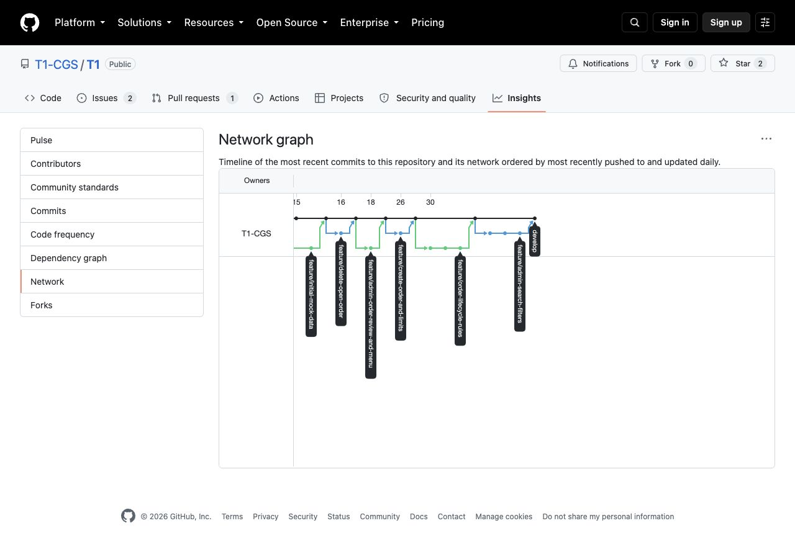

# T1 - Sistema de Controle de Aquisições

Relatório final de desenvolvimento e fluxo Git

2 de outubro de 2026

## Integrantes

| Nome informado pela equipe | Username no GitHub |
| --- | --- |
| Otávio da Silva Machado | otavio0machado |
| Tiago | thiikkj |
| João Vitor | JoaoVitorKF |
| Pedro Alvarenga | PedroDev-Alvarenga |

Repositório público: https://github.com/T1-CGS/T1

Os nomes nesta folha de rosto seguem os dados fornecidos pela equipe. A instituição, a disciplina e o docente não foram informados.

---

## 1. Objetivo e resultado

Desenvolvemos um sistema de controle de aquisições em Java puro, com interface de terminal e dados mantidos em memória. O sistema associa usuários a departamentos, valida os limites de cada pedido e diferencia as ações de funcionário e administrador.

O programa inicia com cinco departamentos, quinze funcionários, cinco administradores e seis pedidos de exemplo. A troca de operador permite demonstrar os dois perfis. O funcionário registra, consulta e exclui seus próprios pedidos abertos. O administrador também avalia pedidos, conclui entregas, pesquisa pedidos e consulta as estatísticas gerais.

| Issue | Funcionalidade entregue | Evidência principal |
| --- | --- | --- |
| #1 | Modelos e troca de usuário | Usuario, Departamento, PedidoAquisicao, ItemPedido e Sessao |
| #2 | Conclusão e bloqueio dos pedidos | Transições controladas e itens imutáveis |
| #3 | Carga inicial em memória | CargaInicial com departamentos, usuários e diferentes status |
| #4 | Registro e limite do departamento | Valor igual ao teto aceito; valor superior recusado |
| #5 | Exclusão pelo criador | Apenas pedido aberto do próprio solicitante |
| #6 | Aprovação, reprovação e menus | Ações e navegação por perfil |
| #7 | Buscas e detalhes | Datas, solicitante e descrição dos itens |
| #8 | Estatísticas gerais | Totais, percentuais, média de 30 dias e maior pedido aberto |

### Organização do código

O pacote modelo representa as entidades e protege o ciclo de vida do pedido. O pacote servico concentra as operações e consultas. Sessao controla o operador ativo; CargaInicial prepara os exemplos; MenuPrincipal recebe os dados e apresenta os resultados. Main permanece como demonstração dos modelos.

O ciclo permitido é ABERTO para APROVADO ou REPROVADO, seguido de APROVADO para CONCLUIDO após a entrega. Somente pedidos abertos aceitam alterações. A conclusão registra automaticamente data e hora. Aprovar, reprovar e concluir são ações do administrador.

---

## 2. Fluxo de trabalho com Git

Adotamos branches feature para cada funcionalidade, develop para integração e main para a versão de entrega. As features são criadas a partir da develop atualizada e integradas por pull requests. Os merges preservam os commits individuais e permitem relacionar cada alteração à sua issue.

Essa separação mantém as tarefas independentes durante a implementação e cria um ponto comum para verificar o comportamento integrado. A integração final em main reúne a versão validada do programa e os materiais de entrega. A branch padrão pode apontar para essa versão final após a publicação.

| Branch | Trabalho associado | Autoria registrada nos commits |
| --- | --- | --- |
| feature/core-models-and-users | Modelos e sessão | Otávio |
| feature/initial-mock-data | Dados iniciais | Pedro |
| feature/create-order-and-limits | Registro e validação de teto | Pedro |
| feature/delete-open-order | Exclusão restrita ao criador | Tiago |
| feature/admin-order-review-and-menu | Avaliação e menus | Tiago |
| feature/order-lifecycle-rules | Conclusão, integridade e testes | João Vitor |
| feature/admin-search-filters | Buscas, detalhes e testes | João Vitor |
| feature/admin-statistics | Estatísticas, testes e CI | Otávio |
| feature/final-report | Relatório e pacote de entrega | Otávio |

Os responsáveis registrados refletem o histórico real. João Vitor implementou a conclusão e as buscas; seus commits foram preservados. Otávio concluiu o painel de estatísticas e a preparação da entrega.

### Evidência do Network Graph



Captura real de https://github.com/T1-CGS/T1/network em 02/10/2026. O gráfico mostra branches e integrações históricas, incluindo os ciclos de vida e buscas. O GitHub informa que essa visualização é atualizada diariamente; o histórico completo e mais recente está registrado em docs/evidencias/historico-git.txt.

---

## 3. Participação individual

Executamos o comando solicitado na atividade, sem contar commits de merge:

```sh
git shortlog -s -n --all --no-merges
```

Saída capturada no snapshot do código 8766482, em 02/10/2026, antes dos commits que adicionam este relatório:

```text
     6  JoaoVitorKF
     4  Otavio Machado
     3  PedroDev-Alvarenga
     2  Thiikkj
     1  Otávio Machado
```

| Integrante | Commits sem merges no snapshot |
| --- | --- |
| João Vitor | 6 |
| Otávio da Silva Machado | 5 |
| Pedro Alvarenga | 3 |
| Tiago | 2 |
| Total | 16 |

Otavio Machado e Otávio Machado são duas grafias da mesma pessoa no histórico e foram somadas apenas na tabela consolidada. A saída original permanece preservada em docs/evidencias/participacao-shortlog.txt. Commits posteriores de documentação e publicação podem aumentar as contagens quando o comando for executado novamente.

A quantidade de commits é uma evidência de participação, mas não mede sozinha a complexidade ou o esforço de cada tarefa. Por isso, ela deve ser lida junto com a tabela de funcionalidades e com os commits do repositório.

---

## 4. Verificação do sistema

Compilamos o projeto com alvo Java 11, avisos do compilador habilitados e tratamento de avisos como erros. Os testes não usam bibliotecas externas. Também configuramos o GitHub Actions para repetir a compilação e os três conjuntos de testes em pushes e pull requests.

```sh
javac --release 11 -Xlint:all -Werror -d out $(find src test -name '*.java')
java -cp out TesteRegrasPedido
java -cp out TesteBuscasPedidos
java -cp out TesteEstatisticasPedidos
```

| Conjunto | Verificações | Resultado |
| --- | --- | --- |
| Ciclo de vida, autorização e regressões | 93 | Nenhuma falha |
| Buscas, datas, detalhes e preservação | 59 | Nenhuma falha |
| Estatísticas, limites, cálculos e menu | 31 | Nenhuma falha |
| Total | 183 | Todas passaram |

Os testes exercitam o modelo, os serviços e o menu real com entrada e saída redirecionadas. Cobrem tentativas de reabertura e edição de pedidos bloqueados, conclusão inválida, limite do departamento, exclusão restrita ao criador, datas inválidas, busca sem resultados e ausência de acesso do funcionário às opções administrativas.

No painel estatístico, todos os percentuais usam o total geral como denominador e consideram o status atual. Os concluídos aparecem separados dos aprovados que ainda aguardam entrega. O período de trinta dias inclui a data da consulta e as vinte e nove anteriores, até o instante da consulta. A média usa o valor total dos pedidos de qualquer status e arredondamento para centavos. O maior pedido aberto é escolhido pelo valor total; em empate, pelo menor número.

Os registros completos dos testes estão em docs/evidencias/. A execução de CI do snapshot 8766482 terminou com sucesso: https://github.com/T1-CGS/T1/actions/runs/37003174251.

---

## 5. Dificuldades e lições aprendidas

O bloqueio dos pedidos exigiu proteger o modelo, porque ocultar uma ação no menu não impede alterações por referências externas. A solução adotada controla as transições de status, devolve uma lista de itens somente para leitura e torna cada ItemPedido imutável. Os testes verificam tanto o caminho normal quanto as tentativas de alteração direta.

As consultas por datas também exigiram uma definição explícita dos limites. Nas buscas, os dias inicial e final entram inteiros; nas estatísticas, a janela corresponde a trinta datas incluindo hoje. Os testes nos limites do intervalo evitam erros que poderiam excluir pedidos do último dia ou incluir pedidos fora da janela.

Outra dificuldade foi manter as métricas de autoria coerentes após os ajustes no histórico. A sincronização das referências preservou o conteúdo e os autores, e a consolidação reconhece as duas grafias usadas por Otávio sem inventar contribuições. A equipe deve atualizar seus clones antes de continuar trabalhando para evitar misturar históricos antigos e atuais.

Concluímos que a combinação de branches por funcionalidade, integração por pull requests, regras de negócio no modelo e testes reproduzíveis torna o desenvolvimento mais verificável. O resultado entregue cobre as funcionalidades previstas nas issues #1 a #8 e mantém rastreabilidade entre tarefas, implementação e validação.

## 6. Execução e entrega

Para executar, é necessário JDK 11 ou superior. Não há banco de dados, cadastro externo ou persistência em disco: a carga inicial é recriada em cada execução, conforme o escopo de dados em memória.

```sh
javac --release 11 -d out $(find src -name '*.java')
java -cp out MenuPrincipal
```

O sistema inicia com a administradora Ana Ribeiro. A opção de troca de usuário permite demonstrar as funcionalidades como funcionário. O README contém os comandos de compilação, teste e uso dos principais fluxos.

A entrega preparada contém o código, os testes, o workflow, o README, este relatório em PDF e sua fonte em Markdown, além das evidências do Network Graph, do histórico Git, das métricas e dos testes. O envio na atividade do Moodle ainda precisa ser realizado quando o acesso estiver disponível; este relatório não afirma que houve submissão.

### Referências e evidências

- Repositório: https://github.com/T1-CGS/T1
- Network Graph: https://github.com/T1-CGS/T1/network
- Estatísticas integradas: https://github.com/T1-CGS/T1/pull/19
- CI verificado: https://github.com/T1-CGS/T1/actions/runs/37003174251
- Requisitos de entrega: https://github.com/T1-CGS/T1/issues/9
